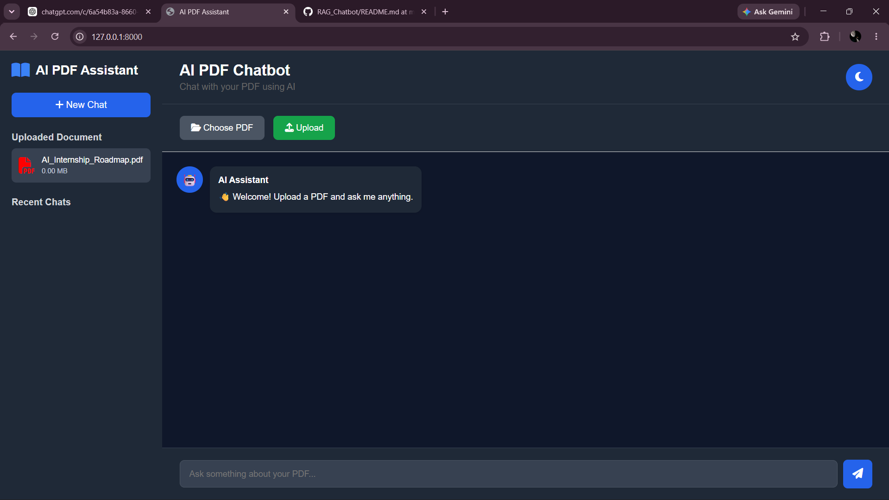
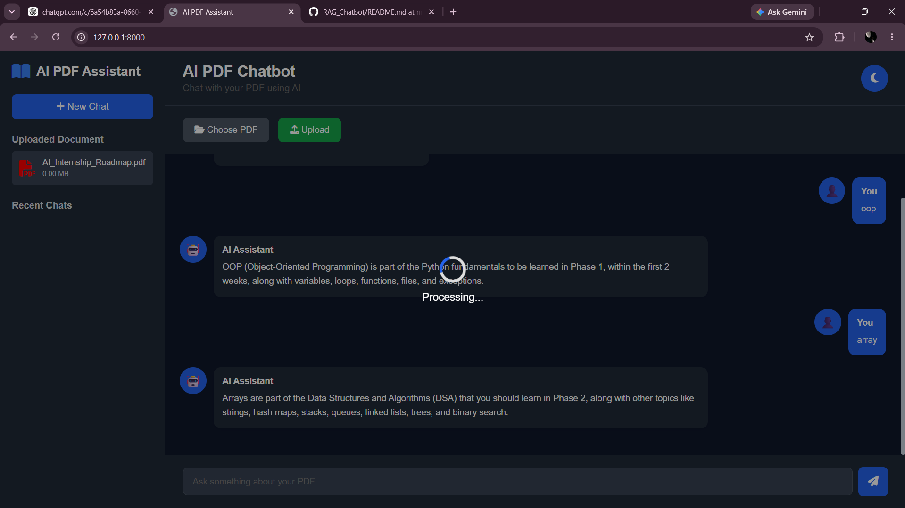
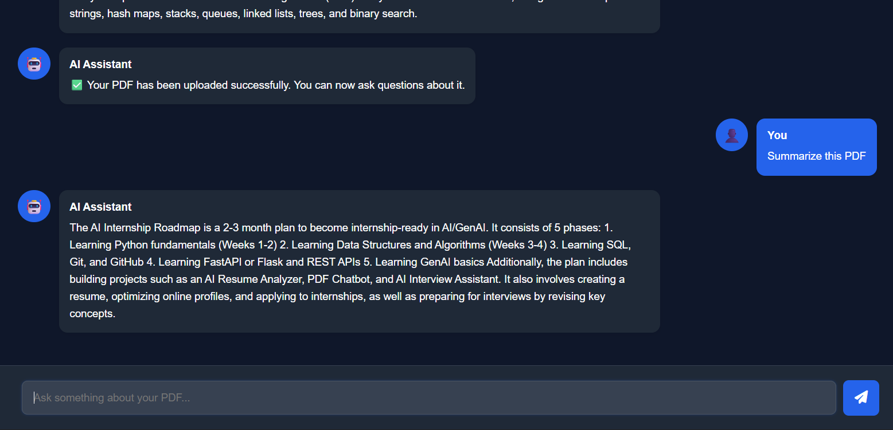

# 🤖 AI PDF Chatbot using RAG


> An AI-powered PDF Question Answering system built using **FastAPI**, **LangChain**, **FAISS**, **HuggingFace Embeddings**, and **Groq LLM**. Upload any PDF and ask questions in natural language to receive intelligent, context-aware answers.

---

## 🚀 Overview

This project implements **Retrieval-Augmented Generation (RAG)** to enable users to chat with PDF documents.

Instead of answering from general knowledge, the application retrieves relevant information from uploaded PDFs using semantic search and then generates accurate responses with a Large Language Model (LLM).

---

## ✨ Features

- 📄 Upload PDF documents
- 🤖 AI-powered question answering
- 🔍 Semantic search using FAISS
- 🧠 HuggingFace sentence embeddings
- ⚡ FastAPI backend
- 💬 Modern responsive chat interface
- 🌙 Clean and professional UI
- 🚀 Groq LLM integration
- 📚 Retrieval-Augmented Generation (RAG)

---

# 📸 Screenshots

## 🏠 Home Page



---

## 📄 Upload PDF



---

## 💬 Chat Interface



---

# 🛠 Tech Stack

### Backend

- Python
- FastAPI
- LangChain
- FAISS
- HuggingFace Embeddings
- Groq LLM

### Frontend

- HTML5
- CSS3
- JavaScript

### AI Technologies

- Retrieval-Augmented Generation (RAG)
- Semantic Search
- Vector Embeddings
- Large Language Models (LLMs)

---

# 🏗 System Architecture

```text
                    User
                      │
                      ▼
             Upload PDF Document
                      │
                      ▼
                PDF Reader
                      │
                      ▼
             Text Chunking
                      │
                      ▼
      HuggingFace Embeddings
                      │
                      ▼
             FAISS Vector Store
                      │
                      ▼
          Similarity Search
                      │
                      ▼
              Relevant Chunks
                      │
                      ▼
                 Groq LLM
                      │
                      ▼
          AI Generated Answer
                      │
                      ▼
               User Interface
```

---

# ⚙ Project Workflow

1. User uploads a PDF document.
2. The PDF is read and converted into text.
3. The text is divided into smaller chunks.
4. HuggingFace creates vector embeddings.
5. Embeddings are stored in a FAISS vector database.
6. User asks a question.
7. FAISS retrieves the most relevant chunks.
8. LangChain sends the retrieved context to Groq LLM.
9. The LLM generates a context-aware answer.
10. The answer is displayed in the chat interface.

---

# 📂 Project Structure

```text
AI-PDF-Chatbot/
│
├── app/
│   └── main.py
│
├── docs/
│   ├── home.png
│   ├── upload.png
│   └── chat.png
│
├── static/
│   ├── style.css
│   └── script.js
│
├── templates/
│   └── index.html
│
├── utils/
│   ├── chunker.py
│   ├── embeddings.py
│   ├── gemini.py
│   ├── groq_llm.py
│   ├── pdf_reader.py
│   ├── retriever.py
│   └── vector_store.py
│
├── requirements.txt
├── README.md
└── .gitignore
```

---

# ⚙ Installation

## Clone the repository

```bash
git clone https://github.com/Bharath17-10/RAG-PDF-Assistant.git
```

```bash
cd RAG-PDF-Assistant
```

---

## Create Virtual Environment

```bash
python -m venv venv
```

Windows

```bash
venv\Scripts\activate
```

Linux / macOS

```bash
source venv/bin/activate
```

---

## Install Dependencies

```bash
pip install -r requirements.txt
```

---

## Configure Environment Variables

Create a `.env` file.

```env
GROQ_API_KEY=YOUR_GROQ_API_KEY
```

---

## Run the Application

```bash
uvicorn app.main:app --reload
```

Open your browser

```
http://127.0.0.1:8000
```

---

# 📖 Usage

- Upload a PDF document.
- Wait for indexing to complete.
- Type a question.
- Receive AI-generated answers based on the uploaded document.

---

# 🎯 Future Improvements

- Multiple PDF support
- Chat history
- User Authentication
- PDF Highlighting
- Voice Input
- Dark/Light Theme Toggle
- Cloud Deployment
- Docker Support
- Conversation Memory
- Export Chat

---

# 💼 Skills Demonstrated

- Python Programming
- FastAPI
- REST APIs
- LangChain
- Retrieval-Augmented Generation (RAG)
- Vector Databases (FAISS)
- HuggingFace Transformers
- Prompt Engineering
- LLM Integration
- Frontend Development
- Git & GitHub

---

# 👨‍💻 Author

**Bharath Kumar**

Computer Science Engineering (Generative AI)

GitHub: https://github.com/Bharath17-10

---

# ⭐ If you found this project useful

Please consider giving this repository a **Star ⭐**.
